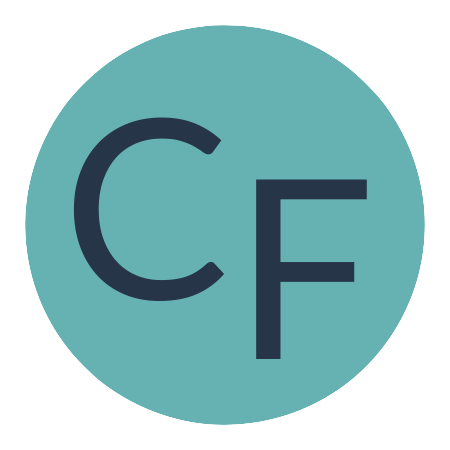
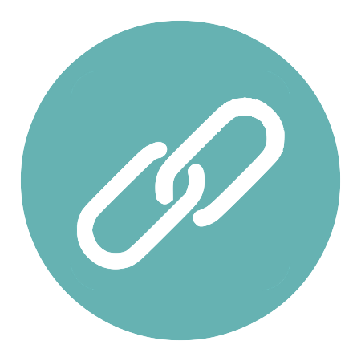

# Caitlin Floyd 👩🏻‍💻 (she/her)
<table>
  <tr> 
    <td width="75px" align="center" >
      
    </td>
    <td>
      
I am a DC-based full-stack software engineer; motivated by the power of technology as a tool for positive change; and with a background in linguistics, education, and nonprofit management.

    </td>
  </tr>
</table>

## Find Me Elsewhere
- <a href="https://caitlinfloyd.com/">
  Portfolio Site
</a>

- <a href="https://www.linkedin.com/in/caitlinfloyd/">
  LinkedIn
</a>

- <a href="https://medium.com/@caitlinfloyd">
  Medium
</a>

- <a href="https://twitter.com/caitlinfloyd">
  Twitter
</a>

## Projects
<table>
  <tr>
    <td width="200px">
        <h3>Couch Potato</h3>
        
         
        
<a href="https://github.com">Repo</a> // <a href="https://github.com">Extension</a>

    </td>
    <td width="200px">
        <h3>Care Kit</h3>
        
         
        
<a href="https://github.com">Repo</a> // <a href="https://github.com">Site</a>

    </td>
        <td width="200px">
        <h3>City Sites</h3>
        
         
        
<a href="https://github.com">Repo</a>

    </td>
  </tr>
</table>