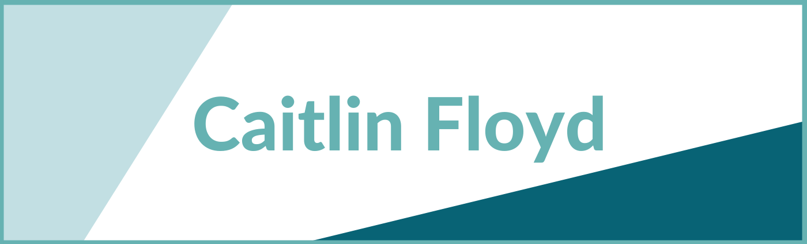

  
  
  
  

I am a DC-based front-end engineer; motivated by the power of technology as a tool for positive change; and with a background in linguistics, education, and nonprofit management.

See [my website](https://caitlinfloyd.com) for more information!

---

## Projects

<table bordercolor="#66b2b2">
  <tr>
    <td width="33%" valign="top">
      
      <h3>avoCart</h3>
         
        
<a href="https://github.com/the-collab-lab/tcl-22-smart-shopping-list">Repo</a> // <a href="https://tcl-22-shopping-list.web.app/">Site</a> // <a href="https://youtu.be/XJ5hsiWm7Z0?t=90">Demo</a>

         
        
Smart shopping list that learns your buying habits and helps you remember what you need to buy on your next trip to the store.  
        Built using React.js, Firebase, Material UI, and Styled Components

        
    </td>
    <td width="33%" valign="top">
      
      <h3>Couch Potato</h3>
         
        
<a href="https://github.com/2001-math-max-fury-road/CouchPotato">Repo</a> // <a href="https://chrome.google.com/webstore/detail/couch-potato/aheloceipokicgchednkbmlaejgcpllo?hl=en-US">Extension</a> // <a href="https://www.youtube.com/watch?v=CQt5qoKtEBU">Demo</a>

         
        
A Chrome extension allowing multiple users to stream video content together remotely.   
        Built using JavaScript, React.js, Express.js, Socket.io, and Heroku

        
    </td>
  </tr>
</table>

---

## Skills

<table>
  <tr>
    <td>
      
    </td>
    <td>
        
        
        
        
    </td>
    <td>
        
        
        
        
        
        
        
    </td>
    <td>
        
        
        
        
        
    </td>
  </tr>
</table>
